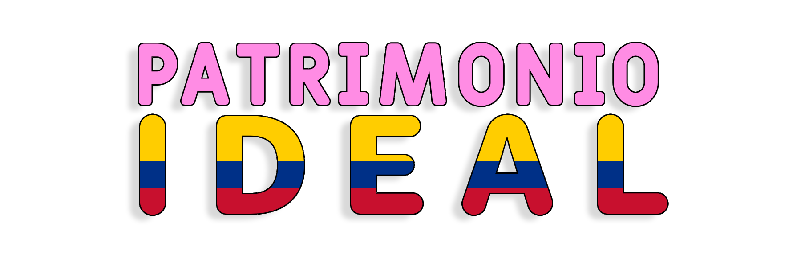

> El progreso verdadero no deja a nadie atras. - Camila Lucía Duque

Patrimonio Ideal (P.I.) es un partido político colombiano de orientación progresista y socialdemócrata, fundado el 28 de abril de 2026 en Bogotá, Colombia. Surgió como grupo significativo de ciudadanos con base en organizaciones juveniles, y busca obtener personería jurídica ante el Consejo Nacional Electoral de Colombia.
